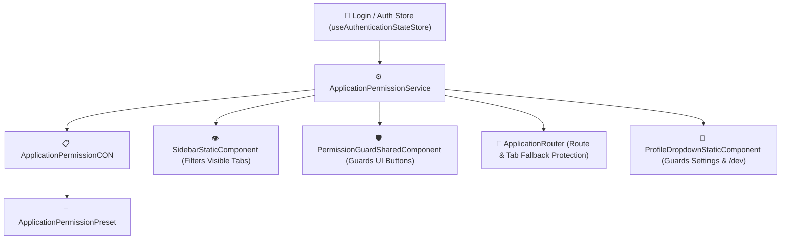

# 🛡️ Dynamic Role-Based Access Control (RBAC) Guide
### 🚀 How to Add, Configure, and Manage User Roles in AssetSphere


---

## 🌟 Welcome to the AssetSphere Role Engine!

AssetSphere is built with a **strict, modular, and dynamic Role-Based Access Control (RBAC)** engine. It gives developers total control over:
1. 👁️ **What each user can SEE** (Navigation tabs, sidebar groups, metrics, pages).
2. ✍️ **What each user can DO** (Registering assets, editing items, importing CSVs, deleting records).
3. ⚙️ **Special zones access** (System Settings, Developer Portal `/dev`, Admin panels).

---

## 📊 Current System Roles & Capabilities

| Role Badge | Primary Purpose | Sidebar Tabs | Core Actions | Special Access |
| :--- | :--- | :--- | :--- | :--- |
|  | View-only end users | **CORE only** (`Dashboard`, `Inventory`, `Licenses`, `Cloud`) | ❌ Read Only (No Add / Edit / Delete) | ❌ None |
|  | Daily IT operators | **CORE only** (`Dashboard`, `Inventory`, `Licenses`, `Cloud`) | ✅ Full Read & Write (Add, Edit, Import, Delete) | ❌ None |
|  | System administrators | **ALL Categories** (Core, Organization, Operations, Intelligence) | ✅ Full Read & Write across all modules | ⚙️ System Settings |
|  | Engineers & developers | **ALL Categories** (Core, Organization, Operations, Intelligence) | ✅ Full Read & Write across all modules | ⚙️ Settings + 💻 Developer Dashboard (`/dev`) |

---

## 🗺️ RBAC Architecture Map



---

## 🛠️ Step-by-Step Blueprint: Adding a New Role

Let's walk through adding a brand-new role, for example: **`AUDITOR`** 🕵️ (A compliance officer who can view all modules across the enterprise, but cannot perform write operations).

---

###  Add Role to Backend Enum

Open [`AssetsphereOrchestratorServiceLayerMSC/Models/Types/UserRoleType.cs`](file:///c:/Users/UddeshyaSingh/Development/AssetsphereAppCodebaseArchitecture/AssetsphereOrchestratorServiceLayerMSC/Models/Types/UserRoleType.cs):

```csharp
namespace AssetsphereOrchestratorServiceLayerMSC.Models.Types;

public enum UserRoleType
{
    USER = 0,
    OPERATOR = 1,
    ADMIN = 2,
    DEVELOPER = 3,
    AUDITOR = 4 // 🌟 Add your new role here!
}
```

---

###  Add Role to Frontend Shared Types

Open [`AssetsphereClientServiceLayerMSC/src/Types/AuthType.ts`](file:///c:/Users/UddeshyaSingh/Development/AssetsphereAppCodebaseArchitecture/AssetsphereClientServiceLayerMSC/src/Types/AuthType.ts):

```typescript
export enum UserRoleType {
  USER = 'USER',
  OPERATOR = 'OPERATOR',
  ADMIN = 'ADMIN',
  DEVELOPER = 'DEVELOPER',
  AUDITOR = 'AUDITOR', // 🌟 Add your new role here!
}
```

---

###  Configure Role Presets

Presets group multiple roles together so you never have to repeat lists of roles.

Open [`AssetsphereClientServiceLayerMSC/src/Presets/ApplicationPermissionPreset.ts`](file:///c:/Users/UddeshyaSingh/Development/AssetsphereAppCodebaseArchitecture/AssetsphereClientServiceLayerMSC/src/Presets/ApplicationPermissionPreset.ts):

```typescript
export default class ApplicationPermissionPreset {
  public static readonly current: ApplicationPermissionPreset = new ApplicationPermissionPreset();

  // Roles that can view Core tabs (USER, OPERATOR, AUDITOR, ADMIN, DEVELOPER)
  public allRoles(): Set<UserRoleType> {
    return new Set<UserRoleType>([
      UserRoleType.USER,
      UserRoleType.OPERATOR,
      UserRoleType.AUDITOR, // 🌟 Included in general viewers!
      UserRoleType.ADMIN,
      UserRoleType.DEVELOPER,
    ]);
  }

  // Roles that can view Compliance & Audit modules
  public complianceAuditorPreset(): Set<UserRoleType> {
    return new Set<UserRoleType>([
      UserRoleType.AUDITOR,
      UserRoleType.ADMIN,
      UserRoleType.DEVELOPER,
    ]);
  }

  // Roles that can WRITE (modify data)
  public operatorRolePreset(): Set<UserRoleType> {
    return new Set<UserRoleType>([
      UserRoleType.OPERATOR,
      UserRoleType.ADMIN,
      UserRoleType.DEVELOPER,
      // ⚠️ Note: AUDITOR is omitted here because auditors are read-only!
    ]);
  }
}
```

---

###  Map Granular Capabilities

Open [`AssetsphereClientServiceLayerMSC/src/Constants/ApplicationPermissionCON.ts`](file:///c:/Users/UddeshyaSingh/Development/AssetsphereAppCodebaseArchitecture/AssetsphereClientServiceLayerMSC/src/Constants/ApplicationPermissionCON.ts):

Assign which preset or role set can view categories, tabs, or trigger specific actions:

```typescript
export default class ApplicationPermissionCON {
  // Category Permissions
  public static readonly CAN_VIEW_CORE_CATEGORY =
    ApplicationPermissionPreset.current.allRoles();

  public static readonly CAN_VIEW_OPERATIONS_CATEGORY =
    ApplicationPermissionPreset.current.complianceAuditorPreset(); // 🌟 Auditor can see Operations!

  // Tab Permissions
  public static readonly CAN_VIEW_TAB_COMPLIANCE =
    ApplicationPermissionPreset.current.complianceAuditorPreset();

  public static readonly CAN_VIEW_TAB_VERIFICATION =
    ApplicationPermissionPreset.current.complianceAuditorPreset();

  // Action Permissions
  public static readonly CAN_WRITE_CORE_ASSETS =
    ApplicationPermissionPreset.current.operatorRolePreset(); // 🔒 Auditor cannot write
}
```

---

###  Enforce in UI & Routing

#### 🎯 1. Declarative JSX Button Guard
Wrap any button or form element with `<PermissionGuardSharedComponent>`:

```tsx
import PermissionGuardSharedComponent from '@/src/Shared/Components/PermissionGuardSharedComponent';
import ApplicationPermissionCON from '@/src/Constants/ApplicationPermissionCON';

<PermissionGuardSharedComponent permission={ApplicationPermissionCON.CAN_WRITE_CORE_ASSETS}>
  <ButtonSharedComponent variant="primary" onClick={onOpenAddModal}>
    + Register New Device
  </ButtonSharedComponent>
</PermissionGuardSharedComponent>
```
> 💡 *If the logged-in user doesn't have permission, this button is completely removed from the DOM!*

#### 🎯 2. Programmatic Service Check
Check permissions in controllers, services, or event handlers:

```typescript
import ApplicationPermissionService from '@/src/Services/ApplicationPermissionService';

if (ApplicationPermissionService.current.canWriteCore()) {
  // Execute write logic
} else {
  toast.error('Access Denied: You do not have permission to modify this asset.');
}
```

#### 🎯 3. Automatic Navigation & Route Fallback
[`SidebarStaticComponent.tsx`](file:///c:/Users/UddeshyaSingh/Development/AssetsphereAppCodebaseArchitecture/AssetsphereClientServiceLayerMSC/src/Features/Navigation/Components/static/SidebarStaticComponent.tsx) and [`ApplicationRouter.tsx`](file:///c:/Users/UddeshyaSingh/Development/AssetsphereAppCodebaseArchitecture/AssetsphereClientServiceLayerMSC/src/Router/ApplicationRouter.tsx) will **automatically filter tabs** and **block deep-links**, redirecting unauthorized visits back to the Dashboard with a toast notification!

---

## 🧪 Seeding & Testing Your New Role

To test your new role with a live account:

1. Open [`AssetsphereOrchestratorServiceLayerMSC/Utilities/DatabaseSeederUtility.cs`](file:///c:/Users/UddeshyaSingh/Development/AssetsphereAppCodebaseArchitecture/AssetsphereOrchestratorServiceLayerMSC/Utilities/DatabaseSeederUtility.cs):
2. Add a seed user for testing:

```csharp
string auditorEmail = "auditor@assetsphere.internal";
string auditorPassword = "AssetsphereAuditor2026!";

if (!await context.Users.AnyAsync(u => u.Email == auditorEmail))
{
    UserEntityClass auditorUser = new UserEntityClass
    {
        Id = Guid.NewGuid(),
        Email = auditorEmail,
        PasswordHash = PasswordHashHelper.Current.HashPassword(auditorPassword),
        FirstName = "Sam",
        LastName = "Auditor",
        Role = UserRoleType.AUDITOR,
        Department = DepartmentType.LegalAndCompliance,
        IsActive = true,
        CreatedAt = DateTime.UtcNow,
        CreatedBy = "seeder"
    };

    await context.Users.AddAsync(auditorUser);
    await context.SaveChangesAsync();
}
```

3. Restart the backend:
```bash
dotnet run --launch-profile "http"
```

4. Log in at `http://localhost:5173/login` with your new credentials and verify!

---

## 🌈 Golden Rules for AssetSphere Permissions

1. 🟢 **Default Deny**: If a permission set is not defined, default to the least role (`USER`).
2. 🟡 **Keep Role Enums Synchronized**: Always ensure [`UserRoleType.cs`](file:///c:/Users/UddeshyaSingh/Development/AssetsphereAppCodebaseArchitecture/AssetsphereOrchestratorServiceLayerMSC/Models/Types/UserRoleType.cs) and [`AuthType.ts`](file:///c:/Users/UddeshyaSingh/Development/AssetsphereAppCodebaseArchitecture/AssetsphereClientServiceLayerMSC/src/Types/AuthType.ts) have identical member names.
3. 🔵 **Use Presets Over Hardcoded Roles**: Avoid checking `role === 'ADMIN'` directly in components; always query [`ApplicationPermissionService`](file:///c:/Users/UddeshyaSingh/Development/AssetsphereAppCodebaseArchitecture/AssetsphereClientServiceLayerMSC/src/Services/ApplicationPermissionService.ts) or [`ApplicationPermissionCON`](file:///c:/Users/UddeshyaSingh/Development/AssetsphereAppCodebaseArchitecture/AssetsphereClientServiceLayerMSC/src/Constants/ApplicationPermissionCON.ts).
4. 🟣 **Two Layers of Protection**: Always protect both the **UI trigger** (hide button) AND the **Route / Service action** (validate permission before action).
