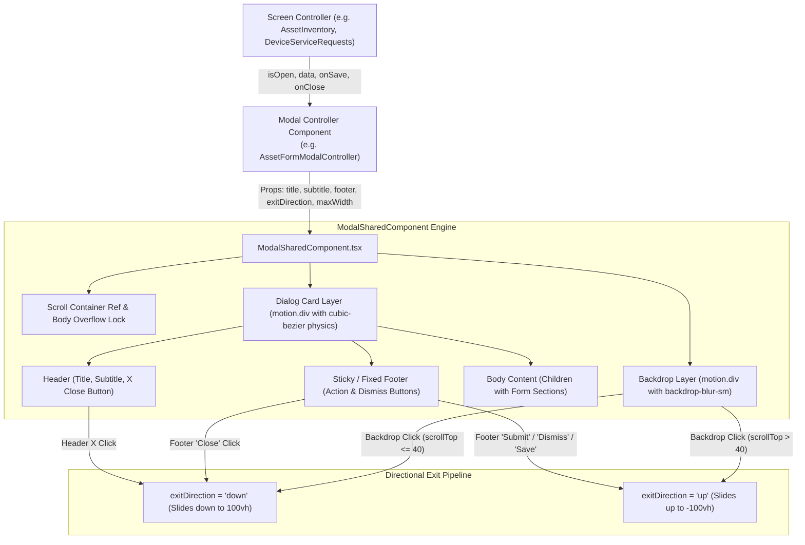

# 🪟 Comprehensive Modal Architecture & Design System Guide
### 🚀 The Canonical Specification for Creating, Styling, and Managing Modals in AssetSphere


---

## 🌟 Executive Overview

In AssetSphere, **all modals and dialogs MUST follow a unified, deterministic architectural contract**. Custom, ad-hoc overlay dialogs or ungrounded `<AnimatePresence>` implementations are strictly prohibited. 

Every modal in the system is powered by [`ModalSharedComponent.tsx`](file:///c:/Users/UddeshyaSingh/Development/AssetsphereAppCodebaseArchitecture/AssetsphereClientServiceLayerMSC/src/Shared/Components/ModalSharedComponent.tsx), which enforces:
1. 🎭 **Consistent Backdrop & Depth**: Blur filter (`backdrop-blur-sm`), semi-transparent backdrop (`bg-slate-900/60 dark:bg-black/60`), and z-index isolation.
2. 🏎️ **Directional Physics-Based Motion**: High-performance Framer Motion transitions with fine-tuned cubic bezier easing (`[0.16, 1, 0.3, 1]`).
3. ↕️ **Smart Dismiss Directions (`exitDirection`)**:
   - **Slide Down (`'down'`)**: Natural closing via Header **`X`** button, Footer **`Close`** button, or top-level backdrop click.
   - **Slide Up (`'up'`)**: Action completion via **`Submit`**, **`Save`**, **`Dismiss`**, **`Cancel`**, or scroll-aware backdrop dismissals.
4. 📐 **Visual Design System**: Monospace uppercase section dividers, standard 15px top section margins, maximum 3-card-per-row responsive grids, and `#0C2086` brand primary accents.

---

## 🗺️ Modal Architecture Map



---

## 📋 Comprehensive Rule Matrix

| Feature / Aspect | Strict Standard / Value | Rationale & Behavioral Implementation |
| :--- | :--- | :--- |
| **Base Component** | [`ModalSharedComponent`](file:///c:/Users/UddeshyaSingh/Development/AssetsphereAppCodebaseArchitecture/AssetsphereClientServiceLayerMSC/src/Shared/Components/ModalSharedComponent.tsx) | Unifies backdrop, escape keys, scroll locks, and spring animations across the codebase. |
| **Animation Type** | `animationType="slide-up"` | Enters from bottom (`100vh` $\rightarrow$ `0`) with cubic bezier `[0.16, 1, 0.3, 1]`. |
| **Scroll Mode** | `scrollMode="backdrop"` (Default) | Allows full-page natural document scrolling for large multi-section forms. |
| **Max Width** | `maxWidth="3xl"` (Forms) / `maxWidth="2xl"` (Standard) | Ensures comfortable reading width and balanced card grids. |
| **Header `X` Button** | Exits **`down`** (`exitDirection = 'down'`) | Mirrors the mental model of dropping or minimizing the window downwards. |
| **Footer `Close` Button** | Exits **`down`** (`exitDirection = 'down'`) | Clean passive dismissal sliding out of view downwards. |
| **Footer `Dismiss` / `Cancel`** | Exits **`up`** (`exitDirection = 'up'`) | Intentional active cancellation / advancement upwards. |
| **Form `Submit` / `Save`** | Exits **`up`** (`exitDirection = 'up'`) | Signifies ticket or entity advancement and completion into the system. |
| **Backdrop Click** | Scroll-Aware (`scrollTop > 40 ? 'up' : 'down'`) | Prevents disorienting downward jumps when the user has scrolled far down the page. |
| **Section Headings** | `text-xs font-bold text-slate-900 dark:text-white uppercase tracking-wider font-mono` | Consistent terminal-style section demarcation with icon + text. |
| **Section Top Spacing** | `mt-[15px]` | Sections 2, 3, 4, etc. MUST have an explicit `15px` top margin. |
| **Card Row Limit** | Max 3 Cards per Row (`grid-cols-1 sm:grid-cols-2 lg:grid-cols-3`) | Prevents excessive horizontal squishing on wide monitors. |
| **Primary Button Accent** | `#0C2086` (`!bg-[#0C2086] hover:!bg-[#081765] !text-white`) | AssetSphere enterprise primary brand blue palette. |

---

## 🎬 Dismiss & Exit Animation Rules (Down vs Up)

### 1. The Principle of Directional Intent
- **Downward Dismissal (`'down'`)**:
  - Used for **passive cancellation, closing, or minimizing**.
  - Animated: `y: 0` $\rightarrow$ `y: '100vh'`.
  - **Triggers**:
    1. Clicking the top-right **`X`** close button in the modal header.
    2. Clicking the secondary **`Close`** button in the footer.
    3. Clicking the dark backdrop when near the top of the modal (`scrollTop <= 40`).
    4. Pressing the **`Escape`** key when near the top.

- **Upward Dismissal (`'up'`)**:
  - Used for **successful submissions, action executions, active dismissals, and upward scroll clears**.
  - Animated: `y: 0` $\rightarrow$ `y: '-100vh'`.
  - **Triggers**:
    1. Submitting the form successfully (e.g. clicking **`Register Device`**, **`Submit Request`**, or **`Save Changes`**).
    2. Clicking a dedicated **`Dismiss`** or **`Cancel`** action button.
    3. Executing workflow state changes (e.g. **`Resolve Ticket`**).
    4. Clicking the backdrop or pressing `Escape` when scrolled deep down a long modal (`scrollTop > 40`).

---

## 🛠️ Step-by-Step Blueprint: Building a Modal Controller

### Step 1: Controller File Structure & Boilerplate
Create a dedicated component under `src/Features/<FeatureName>/Components/<FeatureName>ModalController.tsx`:

```tsx
import React, { useState, useEffect } from 'react';
import { Sparkles, User, Laptop, FileText, CheckCircle2, ShieldCheck } from 'lucide-react';
import ModalSharedComponent from '../../../Shared/Components/ModalSharedComponent';
import ButtonSharedComponent from '../../../Shared/Components/ButtonSharedComponent';
import BadgeSharedComponent from '../../../Shared/Components/BadgeSharedComponent';
import PrimaryActionButtonSharedComponent from '../../../Shared/Components/PrimaryActionButtonSharedComponent';

export interface ExampleModalControllerProps {
  isOpen: boolean;
  initialData?: any | null;
  isLoading?: boolean;
  onClose: () => void;
  onSave: (payload: any) => Promise<void>;
}

export default function ExampleModalController({
  isOpen,
  initialData,
  isLoading = false,
  onClose,
  onSave,
}: ExampleModalControllerProps): React.JSX.Element {
  // 1. Local exit direction state
  const [exitDirection, setExitDirection] = useState<'down' | 'up'>('down');

  // 2. Reset direction to 'down' on every new open
  useEffect(() => {
    if (isOpen) {
      setExitDirection('down');
    }
  }, [isOpen]);

  if (!isOpen) return <React.Fragment />;

  // 3. Handlers with directional intent
  const handleCloseButton = () => {
    setExitDirection('down');
    setTimeout(() => {
      onClose();
    }, 0);
  };

  const handleDismissButton = () => {
    setExitDirection('up');
    setTimeout(() => {
      onClose();
    }, 0);
  };

  const handleSubmit = async (e: React.FormEvent) => {
    e.preventDefault();
    setExitDirection('up');
    await onSave({});
  };

  return (
    <ModalSharedComponent
      isOpen={isOpen}
      onClose={onClose}
      title={initialData ? 'Edit Record' : 'Create New Record'}
      subtitle="Comprehensive enterprise asset and telemetry record"
      maxWidth="3xl"
      scrollMode="backdrop"
      animationType="slide-up"
      exitDirection={exitDirection}
      footer={
        <div className="flex items-center justify-between w-full">
          <div className="flex items-center gap-2">
            <ButtonSharedComponent
              variant="outline"
              size="sm"
              onClick={handleCloseButton}
            >
              Close
            </ButtonSharedComponent>
            <ButtonSharedComponent
              variant="ghost"
              size="sm"
              onClick={handleDismissButton}
              className="text-slate-500 hover:text-slate-700 dark:text-zinc-400 dark:hover:text-zinc-200"
            >
              Dismiss
            </ButtonSharedComponent>
          </div>

          <ButtonSharedComponent
            variant="primary"
            size="sm"
            onClick={handleSubmit}
            disabled={isLoading}
            className="!bg-[#0C2086] hover:!bg-[#081765] !text-white border-none shadow-sm font-semibold"
            icon={<CheckCircle2 className="w-3.5 h-3.5 !text-white" />}
          >
            <span className="!text-white font-medium">{isLoading ? 'Saving...' : 'Save Changes'}</span>
          </ButtonSharedComponent>
        </div>
      }
    >
      <form onSubmit={handleSubmit} className="space-y-6 text-xs">
        {/* Section 1 */}
        <div className="space-y-3">
          <h4 className="text-xs font-bold text-slate-900 dark:text-white uppercase tracking-wider font-mono flex items-center gap-1.5 pb-2 border-b border-slate-100 dark:border-zinc-800">
            <User className="w-3.5 h-3.5 text-blue-500" />
            1. Custody & Personnel
          </h4>
          <div className="grid grid-cols-1 sm:grid-cols-2 lg:grid-cols-3 gap-3">
            {/* Cards (Max 3 per row on lg screens) */}
          </div>
        </div>

        {/* Section 2 (Note the mt-[15px]) */}
        <div className="space-y-3 mt-[15px]">
          <h4 className="text-xs font-bold text-slate-900 dark:text-white uppercase tracking-wider font-mono flex items-center gap-1.5 pb-2 border-b border-slate-100 dark:border-zinc-800 mt-[15px]">
            <Laptop className="w-3.5 h-3.5 text-blue-500" />
            2. Hardware Configuration
          </h4>
          <div className="grid grid-cols-1 sm:grid-cols-2 lg:grid-cols-3 gap-3">
            {/* Cards */}
          </div>
        </div>
      </form>
    </ModalSharedComponent>
  );
}
```

---

## 🎨 Header & Typography Standards

### 1. Title & Subtitle Styling
- **Title**: Rendered using `font-serif-headline font-bold text-slate-900 dark:text-zinc-100 text-lg` with optional inline badges (`BadgeSharedComponent`).
- **Subtitle**: `text-xs text-slate-500 dark:text-zinc-400 mt-0.5`.
- **Top-Right `X` Button**: Automatically bound in [`ModalSharedComponent`](file:///c:/Users/UddeshyaSingh/Development/AssetsphereAppCodebaseArchitecture/AssetsphereClientServiceLayerMSC/src/Shared/Components/ModalSharedComponent.tsx) to trigger `handleHeaderClose()` $\rightarrow$ exits **`down`**.

### 2. Section Headings & Spacing
- **Heading Format**:
  ```tsx
  <h4 className="text-xs font-bold text-slate-900 dark:text-white uppercase tracking-wider font-mono flex items-center gap-1.5 pb-2 border-b border-slate-100 dark:border-zinc-800 mt-[15px]">
    <IconComponent className="w-3.5 h-3.5 text-blue-500" />
    {SectionNumber}. {SectionTitle}
  </h4>
  ```
- **Heading Numbers**: `1. General Information`, `2. Hardware Details`, `3. Custody & Deployment`, etc.
- **Top Margin**: Sections 2, 3, 4+ MUST specify `mt-[15px]`.

---

## 📦 Responsive Grid Architecture (Max 3 Cards per Row)

To prevent visual clutter on wide displays:
- **Small Screens**: 1 column (`grid-cols-1`).
- **Medium Screens**: 2 columns (`sm:grid-cols-2`).
- **Large & Extra Large Screens**: **Strict maximum 3 columns** (`lg:grid-cols-3`).

```tsx
{/* Canonical 3-card max grid */}
<div className="grid grid-cols-1 sm:grid-cols-2 lg:grid-cols-3 gap-3">
  <div className="p-3 rounded-xl bg-slate-50 dark:bg-zinc-800/40 border border-slate-200/60 dark:border-zinc-700/60">
    <span className="text-[10px] text-slate-400 font-mono block">Field Label</span>
    <span className="font-semibold text-slate-900 dark:text-white block truncate">Field Value</span>
  </div>
</div>
```

---

## 🔍 Canonical References in Codebase

Study these reference controllers whenever building or modifying modals:
1. 💻 [`AssetFormModalController.tsx`](file:///c:/Users/UddeshyaSingh/Development/AssetsphereAppCodebaseArchitecture/AssetsphereClientServiceLayerMSC/src/Features/AssetForm/AssetFormModalController.tsx): Full multi-section form with presets, custom dropdowns, and dynamic unit inputs.
2. 👁️ [`AssetDetailModalController.tsx`](file:///c:/Users/UddeshyaSingh/Development/AssetsphereAppCodebaseArchitecture/AssetsphereClientServiceLayerMSC/src/Features/AssetDetail/AssetDetailModalController.tsx): Rich inspection modal with tabs, diagnostics, and chain of custody.
3. 👤 [`EmployeeFormModalController.tsx`](file:///c:/Users/UddeshyaSingh/Development/AssetsphereAppCodebaseArchitecture/AssetsphereClientServiceLayerMSC/src/Features/Employees/Components/EmployeeFormModalController.tsx): Personnel form with sub-modal spawning.
4. 🔧 [`DeviceServiceRequestDetailModalController.tsx`](file:///c:/Users/UddeshyaSingh/Development/AssetsphereAppCodebaseArchitecture/AssetsphereClientServiceLayerMSC/src/Features/DeviceServiceRequests/Components/DeviceServiceRequestDetailModalController.tsx): Operator workflow inspection modal with resolution logs and status transitions.
5. 🛡️ [`ModalSharedComponent.tsx`](file:///c:/Users/UddeshyaSingh/Development/AssetsphereAppCodebaseArchitecture/AssetsphereClientServiceLayerMSC/src/Shared/Components/ModalSharedComponent.tsx): The core engine backing all modal dialogs in AssetSphere.

---

## 🛑 Common Anti-Patterns to Avoid

| ❌ Anti-Pattern | Why It Fails | ✅ Correct Pattern |
| :--- | :--- | :--- |
| Handcrafting `<AnimatePresence>` + `<motion.div>` overlays directly in screen controllers | Inconsistent backdrop colors, no scroll awareness, broken escape key handlers. | Use [`ModalSharedComponent`](file:///c:/Users/UddeshyaSingh/Development/AssetsphereAppCodebaseArchitecture/AssetsphereClientServiceLayerMSC/src/Shared/Components/ModalSharedComponent.tsx). |
| Hardcoding `exitDirection="down"` for all actions | Submitting a form or resolving a ticket feels like it's being discarded rather than completed. | Pass `exitDirection={exitDirection}` and set `'up'` on submission/completion. |
| Using `md:grid-cols-4` in modal sections | Fields become too narrow and truncate text on standard 1080p and laptop screens. | Use `lg:grid-cols-3` maximum for 3 cards per row. |
| Omitting `mt-[15px]` on subsequent sections | Section headers collide into preceding cards without visual breathing room. | Add `mt-[15px]` on sections 2, 3, 4+. |
| Using random blue hex codes (`#2563eb`, `#3b82f6`, `bg-indigo-600`) | Breaks brand harmony. | Always use `#0C2086` (`!bg-[#0C2086] hover:!bg-[#081765]`). |
